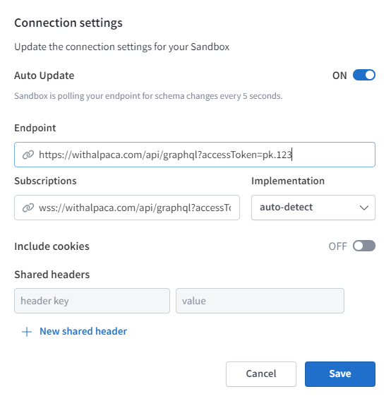

<div align="center">
  
</div>

# Alpaca Travel GraphQL API

> The [Alpaca Travel](https://alpaca.travel) GraphQL API provides developers
> with easy access to the platform's itinerary content for use in interactive
> applications and user interfaces.

- Easily access and manipulate itinerary data through a GraphQL API
- Incorporate platform's itinerary content into custom interactive applications
  and user interfaces such as travel itinerary planners and trip planning
  websites.
- Retrieve and display itinerary information, including maps, routes, places and
  uploaded content, in desired format.
- Engage with your audience and offer personalized travel experience by
  providing basic itinerary planning features.
- Convenient tool for including platform's itinerary content in your project,
  and for providing your users the ability to create and update itineraries.

The Alpaca Travel platform supports a wide range of itineraries, including:

- Road-trips
- Walking and hiking trails
- Flights and other modes of transportation
- Top-10 lists and other types of curated content

The Alpaca Travel platform offers more than just itinerary management, it also
includes features such as guide and directory creation, location search and
place information loading to enhance the functionality of your travel-related
application or website. In addition to the GraphQL API, we also provide hosted
mapping services for accessing and presenting data on maps. You can access these
services by visiting our [mapping documentation](https://github.com/AlpacaTravel/mapping-docs)
for more information.

## Getting Started with the Alpaca GraphQL API

The Alpaca Travel Platform is accessed using GraphQL, a powerful and easily
integrated techology for your website or application. You can read some
supporting information on GraphQL and why it is used below.

- **[Topics](#topics)** - We are grouping together common requirements have
  under [topics](#topics) to bring developers up to speed quickly on certain
  concepts they may need.
- **[Tutorials](#tutorials)** - We will also be expanding on examples and topics
  to create series in the form of [tutorials](#tutorials) to expand upon
  concepts and create complete working examples.
- **[Example Applications](#example-applications)** - We have provided some
  working examples of apps for you to play and adapt that demonstrates the
  technology in use.
- **[Example Operations](/example-operations)** - We have put together concrete
  examples of typical calls to the API in our
  [example operations](/example-operations) section. These will assist you
  become familiar with GraphQL as well as the capabilities of the platform.

Finally, we recommend the [Apollo Sandbox](https://studio.apollographql.com/sandbox/explorer).
See below for moree information.

### Endpoint URL

In order to interact with GraphQL, you will need to use the following root
endpoint:

```
https://withalpaca.com/api/graphql?accessToken=<YOUR_API_KEY>
```

When using the root endpoint, it is important to authenticate via providing your
`accessToken` (which is your API Key) as a query parameter.

#### GraphQL Playground "AKA Apollo Sandbox"

GraphQL offers an introspection capability with a defined schema. This helps you
develop the query that suits your specific use case or technical needs without
having to go through a lot of API Documentation. Through the Apollo Sandbox,
you can try out your queries and mutations directly onto the GraphQL
environment.

Visit the [Apollo GraphQL Sandbox](https://studio.apollographql.com/sandbox/explorer).

Open the connection settings, and specify the endpoint to the end-point written
above.

<p align="center">
  
</p>

Rember to add your `?accessToken=` to the URL.

#### New to GraphQL?

GraphQL is a flexible data query language that allows you to design queries that
match your use case. Opposed to making several REST API requests or over/under
fetching data for your application, you craft a query to obtain the data you
need.

GraphQL is sent as JSON using a standard HTTP request. This makes it possible
for many different languages and frameworks capable of being able to execute
GraphQL calls to the Alpaca Travel GraphQL API.

If you are new to GraphQL, the following educational resources may be helpful as
a starting point.

- [Introduction to GraphQL](https://graphql.org/learn/)
- [How to GraphQL](https://www.howtographql.com/)
- [Guides and Best Practices](https://www.graphql.com/guides/)
- [GraphQL Clients](https://graphql.org/graphql-js/graphql-clients/)
- [Awesome GraphQL](https://github.com/chentsulin/awesome-graphql)

GraphQL implementations can be simple as executing a query, and can then perform
better tools to handle caching and more advanced topics to support your app.

## Authentication

You will need to obtain your API Key in order to authenticate your application
when making calls to GraphQL. We accept the API Key as an `?accessToken=` query
parameter.

### Authorisation

Your API Key will have different read and write scopes, depending on when it is
created. By default, Alpaca Travel offers both private and public API Keys. A
private API Key will enable the application to perform mutations on profiles
it has been assigned, where the public API Key is read only access to content.

- **Public Scope** Able to read from assigned profiles and author anonymous
  itineraries. For use in front-end applications without priviledges to the
  profile.
- **Private Scope** Able to read/write from assigned profiles (full access).
  Do not share this API Key with the public.

### Obtaining your API Key

Your API Key is available by request during our BETA testing phase. Please
contact us via <sayhello@alpaca.travel> or following the URL
<https://alpaca.travel>. You must agree to the terms and conditions to use
this service.

## Terminology

As a broad starting point to understanding the terminology and parts of the
GraphQL service:

- A **Collection** provides a way to manage information about your locations
- An **Itinerary** helps you represent favourites, tracks and trails, trips and
  itineraries

## Topics

The following sections can help you become familiar with the GraphQL API for
your purposes.

More coming soon. Make us a suggestion.

### Itinerary

Itineraries are the data structure to store simple lists to complex
multi-segment scheduled itineraries (and what is in-between).

If you'd like a quick overview of everything, you should start with
[Managing a List](/topics/itinerary/Managing%20a%20List/) or
[Managing a Trip](/topics/itinerary/Managing%20a%20Trip/) which will provide
you with a quick overview of managing an itinerary from start to end.

- **[Creating an itinerary](topics/itinerary/Creating%20an%20itinerary/README.md)**
  Start with creating an itinerary either anonymously or assigned to a profile,
  to house your saved/favourited list, trail, track, trip or itinerary
- **[Checking if a place is within an itinerary](topics/itinerary/Checking%20if%20a%20place%20is%20within%20an%20itinerary/README.md)**
  Determine if a place you are viewing is already within an itinerary
- **[Adding Locations](topics/itinerary/Adding%20Locations/README.md)**
  Add locations to your itinerary
- **[Showing/Querying an Itinerary](topics/itinerary/Querying%20an%20Itinerary/README.md)**
  Present the itinerary back to the user
- **[Automatic Routing](topics/itinerary/Automatic%20Routing/README.md)**
  Leverage the automatic routing feature of itineraries, to automatically
  provide directions between locations
- **[Places of interest](topics/itinerary/Places%20of%20interest/README.md)**
  Creating places of interest associated to locations
- **[Reordering Locations](topics/itinerary/Reordering%20Locations/README.md)**
  Provide the ability for the user to reorder the itinerary to suit
- **[Adding Directions](topics/itinerary/Adding%20Directions/README.md)**
  Add more complex directions, including multi-modal or manual directions (such
  as GPS tracks)
- **[Adding Photos](topics/itinerary/Adding%20Photos/README.md)**
  Add photos for itinerary or itinerary locations
- **[Segments](topics/itinerary/Segments/README.md)**
  Group itinerary items into trip segments
- **[Mapping](topics/itinerary/Mapping/README.md)**
  Accessing information from the API as a GIS data source for itinerary
  information
- **[Classifications](topics/itinerary/Classifications/)**
  Apply classifications to itineraries, such as genres, travel styles,
  audiences, as more.
- **[Drafts and Publishing](topics/itinerary/Drafts%20and%20Publishing/)**
  Control how mutations are applied, either to a draft, or to the published
  version.
- **[Custom Data](topics/itinerary/Custom%20Data/)**
  Add in custom data to the itinerary data structure, such as storing your own
  ID's or other simple values.

### Collections

Collections support the ability to create groups of places or itineraries to
power your website or application.

- **[Managing collection locations](topics/collection/Managing%20collection%20locations/README.md)**
  Managing collection locations, including listing, creating, updating and
  removing
- **[Importing Locations](topics/collection/Importing%20Locations/README.md)**
  Working with concepts of importing 3rd party locations from another platform

### Places / Place Information

We support working with various place providers on the platform, to access place
information and keep your place information up to date.

- **[Working with Open Street Map (OSM)](topics/places/Working%20with%20OSM/README.md)** Access
  information directly from OpenStreetMaps database
- **[Australian Tourism Data Warehouse (ATDW)](topics/places/Working%20with%20the%20ATDW/README.md)**
  Alpaca provides the ability to query and use data from the ATDW API through a
  GraphQL interface, allowing you to easily structure the data into itineraries
  or your own collections, as well as access all the rich data from ATDW in a
  convenient and consistent way, speeding up your integration. You can also
  store additional data beside ATDW data, including missing places or additional
  data attributes (tags, custom data etc)
- **[Facebook Pages](/topics/places/Working%20with%20Facebook%20Pages/)**
  Alpaca provides a mechanism to load place information from Facebook Pages.
  This can help keep your itinerary up to date with loading place information
  from Facebook, including opening hours and more.
- **[Accessing Hours](topics/places/Accessing%20Hours/README.md)**
  Access information about opening hours of a vendor, and present them in
  time zone appropriate formats.
- **[Standard place attributes](topics/places/Standard%20place%20attributes/README.md)**
  Standardised place attributes used to provide extensible information around
  places.

Other providers integrated include; TripAdvisor, Zomato, Yelp, WOF, GeoNames,
Foursquare, Facebook, Wikidata are more.

### Position

- **[Position attributes](topics/position/Position%20attributes/README.md)**
  Access global information about a position, such as region, time-zone or ISO
  data, or local data such as information about a location from the ABS dataset

### Media

Various media can be accessed on the Alpaca platform.

- **[Uploading photos](topics/media/Uploading%20photos/README.md)** Upload
  photos to be served in content leveraging optimising and serving via CDN
- **[Using Unsplash](topics/media/Using%20unsplash/README.md)** Referencing a
  photo on the unsplash platform
- **[Querying media](topics/media/Querying%20media/README.md)** Querying media

### Icons

- **[Managing profile icons](topics/icons/Managing%20profile%20icons/README.md)**
  Managing profile icon sets
- **[Associating itinerary icons](topics/icons/Associating%20itinerary%20icons/README.md)**
  Associating icons for use in itineraries

### GraphQL

Topics across our API can be explored from the following list;

- **[Pagination using cursor connections](/topics/graphql/Pagination%20using%20cursor%20connections/README.md)**
  Using the standarised best practice for pagination using cursor connections
- **[Attributes](/topics/graphql/Attributes/README.md)**
  Using attributes to access or update extended data for resources, including
  storing localisation or custom values against supported resources

### JavaScript

- **[Making GraphQL Calls](topics/javascript/Making%20GraphQL%20Calls/README.md)**
  Simple methods for executing GraphQL using JavaScript
- **[Create React App](topics/javascript/Create%20React%20App/README.md)**
  Get started with a template to build React Apps in Typescript/Apollo with
  added codegen to make development faster.
- **[React Apollo Client](topics/javascript/react/Apollo%20Client/)**
  Get started with React and Apollo Client to access an itinerary

### Alpaca GraphQL JavaScript SDK

- **[Alpaca GraphQL JavaScript SDK](https://github.com/AlpacaTravel/graph-sdk)** (New)
  SDKs based on popular JavaScript development environments, including `React`,
  `Vue`, `Svelte` and `Stencil`. The SDK provides options for developers such as
  leveraging `urql`, `graphql-request`, `react-query`and `apollo`.

More Coming soon

## Example Applications

We have included some example stand-alone code that you can use to build upon
in order to display content from the Alpaca Travel service.

These are provided as working examples you can modify for your own uses.

- **[React/Apollo Load Itinerary](https://codesandbox.io/s/alpaca-travel-react-apollo-client-itinerary-t37bg9)**
  Simple example of a react application loading an itinerary using the
  "itinerary" operation.
- **[React Place Slider](https://codesandbox.io/s/alpaca-travel-collection-location-sliding-cards-2kpjt?file=/src/components/Slider.js)**
  Example loading a "slider" of location cards from a collection pulling in
  information from Australian Tourism Data Warehouse (ATDW). You can customise
  and run this in browser as a demo (code sandbox).
- **[React Opening Hours](https://codesandbox.io/s/alpaca-travel-graphql-opening-hours-cggl9?file=/src/opening-hours/opening-hours.tsx)**
  Example loading of a place opening hours, demonstrating some presentation of
  current status or schedule for a series of dates.

More examples to come

## Example Operations

A catalogue of example [GraphQL queries and mutations](/example-operations) are
provided as example gists for you to refer to for specific functionality.

## GraphQL Schema Reference

You can [review the reference schema documentation](reference/README.md).

## Support :thumbsup:

Alpaca Travel offers support for API clients. Clients are provided access to
Basecamp to manage integration projects, or alternatively questions can be
directed to <sayhello@alpaca.travel>.

## Contributing

We are happy to accept pull-requests, suggestions and corrections.

We have quality control mechanisms to assist in keeping the documentation is
kept maintained. This includes GitHub actions to validate site links as well
as valid GraphQL examples (in both .graphql files and featuring in markdown).

Sections such as the [reference](reference/README.md) is managed external to
this repository and can't be changed. In that case, please describe the change
to us in an Issue, and we will resolve.

### Quick Edits

You can make quick edits through GitHub by using the pencil :pencil2: edit
process and submit a pull request.

### Further Edits

Alternatively, you can pull down the git repo to make your changes. You can
check your changes by using the following commands:

```
npm i
npm test
```

Note: This documentation package is validated against GraphQL and we check
to make sure we don't have dead links. Please check against mistakes using
`npm test` above.

## Legal Statement

Copyright © 2020-2021 Alpaca Travel. All right reserved.
