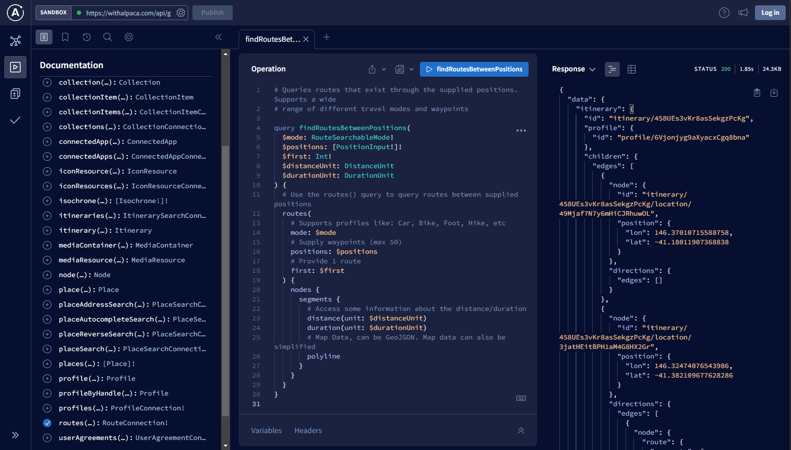
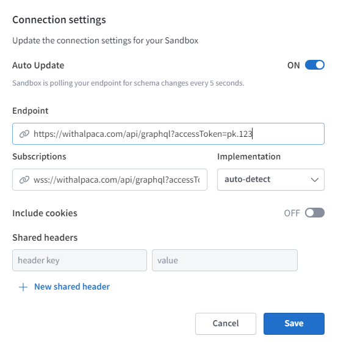

# Apollo Sandbox - a GraphQL Playground

  

GraphQL offers an introspection capability with a defined schema. This helps you
develop the query that suits your specific use case or technical needs without
having to go through a lot of API Documentation.

Through the
[Apollo Sandbox](https://studio.apollographql.com/sandbox/explorer?endpoint=https%3A%2F%2Fwithalpaca.com%2Fapi%2Fgraphql%3FaccessToken%3DUPDATE-TOKEN)
, you can try out your queries and mutations directly onto the GraphQL
environment.

- Lists out all the query and mutation operations and type fields that are
  available for the Alpaca Travel GraphQL API

- Supports autocompletion and validation of your operations

- Provides the ability to send operations and see the response

Visit the
[Apollo GraphQL Sandbox 🔗](https://studio.apollographql.com/sandbox/explorer?endpoint=https%3A%2F%2Fwithalpaca.com%2Fapi%2Fgraphql%3FaccessToken%3DUPDATE-TOKEN).

## Updating Connection Settings

Open the connection settings ⚙️.

  

In order to interact with GraphQL, you will need to use the following root
endpoint and update `?accessToken=<YOUR_API_KEY>` with your credentials.

    https://withalpaca.com/api/graphql?accessToken=<YOUR_API_KEY>

## Further Reading

- **[Token Authorization](/topics/graphql/Token%20Authorization/)** Understand
  the token and the associated permissions
