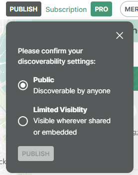

[//]: # "Weight: 2"
[//]: # "TOC: false"
[//]: # "Layout: 1-col"

# Discoverability

In order for content to be returned when listing itineraries for a profile, the
Itinerary must be `published` as well as have the `listed` property set.



When querying using a public scoped access token:

- Content that does not have the attribute `listed` set to true will not be
  returned when requesting itineraries for a profile
- Only content that is `published` will be returned.

If you are using your secret key, you will be able to retrieve all your content
regardless of the discoverability controls.

<aside class="note">
  We request that you disable adding share or embed controls when displaying
  content that does on return a value of `true` for this listed attribute. You 
  should also consider the appropriate SEO tags, such as setting `noindex`.
</aside>

```graphql
query GetItineraryIsListed {
  itinerary(id: "itinerary/123") {
    id

    # Determine if this content should be discoverable
    # Must be a boolean returning with exactly true
    listed: attrValue(id: "itinerary/listed")
  }
}
```

Sandbox: [Configure](/topics/graphql/Apollo%20Sandbox/) |
[Try Operation](https://studio.apollographql.com/sandbox/explorer?explorerURLState=N4IgJg9gxgrgtgUwHYBcQC4QEcYIE4CeABAOIIoCSKAlkvgIaEUDOAMtcygmEcADpIiRajTp5GBABTUw6InxAjaDQgHoAjACYAzAoCUvAUKEyBR4wGIiAEXL44y4QDMiKABYciUCKmQoizG4QMAA2PABGCERgHN4AbgzhIQjmQlYAsjCcRJFE9DkQEMn0gnjkMHhItADmRADuIm5ECAAe9FAoIcQoeLipRCEcXLJ5KD0AavQhuNIjCkpiEqqDnNz65gC+AhsgG0A)
