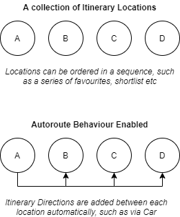
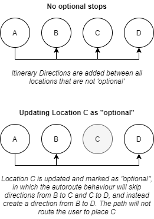

# Automatic Routing between Locations

To assist with a common use case, you can leverage a basic feature known as
automatic routing for your itinerary.

- Add directions automatically between Locations

- Can be enabled on existing itineraries (such as simple lists or favourites)

- Supports making stops optional

- Can use preferred entry positions for locations

- Supports a wide range of direction modes, including Car, Foot, Bike, Hike etc

- Can change the directions to use specific modes of transport, such as
  alternating between Car/Foot/etc.

- Can customise to include waypoints or preferred directions

This feature when applied will assist creation of an itinerary by automatically
creating directions between the sequence of locations as they are added to the
itinerary.

<p align="center">
  
</p>

Directions contain information such as duration and distance estimates based, as
well as providing map data for rendering.

There are a number of supported routing modes provided by Alpaca Travel that can
be used to search for routes

- Basic Profiles: Car, Foot, Bike, etc

- Advanced Profiles: MountainBike, Hike, Bus, Motorcycle, Scooter, etc.

### Prerequisits

- GraphQL development environment (or GraphQL Playground)

- Your API Key

```graphql
# Creates an itinerary, and configures it to assign automatic routes. Automatic
# routes will assist basic itineraries by sequentially linking locations that
# are added with directions, providing information about moving between these
# locations.

mutation CreateItineraryWithCarAutoRoute {
  # When using the createItinerary mutation to create our itinerary
  createItinerary(
    itinerary: {
      # Add our basic required fields
      title: "Example Itinerary"
      # Indicate the behaviour to auto route using Car as the default mode
      autoRoute: { defaultMode: Car }
    }
  ) {
    # Read back the created itinerary
    itinerary {
      # Access the Identifier, required for further query/mutations
      id
    }
  }
}
```

Sandbox: [Setup](/topics/graphql/Apollo%20Sandbox/)
[View Operation](https://studio.apollographql.com/sandbox/explorer?explorerURLState=N4IgJg9gxgrgtgUwHYBcQC4QGIAEBhAJwQEMUEBnHYpHASxVqQQOIIE8AaKpMHKCJADNaAcxhFK9HCghVy5UTWIwZcUrSg4CEFRQB0OAIIqIahlAA6SXNt2UA7rQA2TuQvIocAI2ILN9RmZWWgpvNhxyBABHGGQGYhdwp0YAa0YRHCdodQFKFAALUitcVgQqMDAEXkcCnDBaIigGXK4AB20AN1p6pAzGQQgCM1oBKi8dTzgILt7vBBR7BGRpfIoEYszs5qRyPSsrOBUcmkISMgBJBiYWdgB1eny8VmMZACUJsuArHBxcW9WaDAFLMCmUoERSAhLoEbuFDihjtJZOCzmUdAQ6FcguxvnwIRcsbCABS4n4Ba6sNjoHBfGg-em4QwVHDo7y+DRaaIwBpVHDCBBOMDkUn0hgoJwIakWEAAUQAHsQ4K0JThoRScSART9cOceBpISsyl4EIUuqyZFQTFoPjggel8Kw5Ia6ghBMonJMIJUtZa3h9qcAXW6YB6ALJeyUOjEAXxFsbpAEoaSLcK8SLwfFAUs6UZDeOTsWwRQXYcm6fTfkYoFAKHlVqrKqhaPyCFwiDEebwBhjBOJQRiYsw2AB6eHHYXl+ndOO4+PRkDRoA)

## Enabling on an existing Itinerary

It can be possible to enable automatic routing on an existing itinerary by
performing an mutation to update the itinerary.

```graphql
# Enable "auto-route" behaviour to an existing itinerary. Auto-route will assist
# users create itineraries with directions automatically added between locations

mutation UpdateItineraryAssignCarAutoRoute {
  # Use the updateItinerary to modify an existing itinerary
  updateItinerary(
    # Supply the identifier of the itinerary
    id: "itinerary/ABC123"
    # Change the property of autoRoute to assign a default mode
    itinerary: { autoRoute: { defaultMode: Car } }
  ) {
    # Read back information
    itinerary {
      id
      autoRoute {
        defaultMode
      }
    }
  }
}
```

Sandbox: [Setup](/topics/graphql/Apollo%20Sandbox/)
[View Operation](https://studio.apollographql.com/sandbox/explorer?explorerURLState=N4IgJg9gxgrgtgUwHYBcQC4QGIAEBRJAQwCMAbBHAHREJhQgFoAnCOhanYhAC0IDcAlqyY56OQkhwIAHgIDOKAUgDmOAYqQImhJgE8AdDgCCdRizY4A7gNKlxcufJSUkuGHK1ycUJgkIoKdSUtHQEEL2sUbhwwAV8oRQgkL1p6OH8BKEJbXXEwMAQwTgQUSwRkHFJoDKS5Fxc4OhrJAFUABzB-BABJDRC9IwcBZSQAYR0TegAlVgCcYBccHFwWj1FuChgOrt7g7T1RCBw4CFiAM1yJKVkFJVUgzX3dRZwtzoDdx51dAAoXpdwAGUtm1SLkooECqgBGcwiIIGd1oE+k9-mowOgqCAHv1dAB6IwAIVGAEYAEwAZmoaNwo14KgoEJwbRYbS0KFyCPEphmFjEhCGI3EMQQZ1opBQx1O7EkSzUKO+mOA3OmswQSpFYpgEoAstLMeMRABfHBGl4ASnmNJwUz8RWIhCgAGs1EgzhAmOlEkg0TinlbZXL0WilqkILy5gtA0HNeKUHqCiHTWizbLU0aQEagA)

## Making locations "optional"

The Alpaca auto-route feature will create a sequence of ItineraryDirections
between each of the ItineraryLocations that are added to an itinerary with this
behaviour enabled.

In some use-cases, you may wish to not automatically route to a specific
location, as it may be along the way between two locations, but not a mandatory
stop for users.

<p align="center">
  
</p>

```graphql
# Updates an itinerary location and marks the itinerary location as an optional
# stop

mutation UpdateItineraryLocationAsOptional {
  # Use updateItineraryLocation mutation for making changes to ItineraryLocation
  updateItineraryLocation(
    # Supply your itinerary location that you wish to make optional
    id: "itinerary/ABC123/item/DEF456"
    # Supply the location fields changing
    location: {
      # Update the location to be marked as optional
      optional: true
    }
  ) {
    # Query back your location
    location {
      # Optional should now be true
      optional
    }
    # Optionally see what else has been affected, such as a result of the
    # autoroute behaviour updating new and existing ItineraryDirections when
    # using this feature.
    cascaded {
      created {
        id
        __typename
      }
      updated {
        id
        __typename
      }
      deletedIds
    }
  }
}
```

Sandbox: [Setup](/topics/graphql/Apollo%20Sandbox/)
[View Operation](https://studio.apollographql.com/sandbox/explorer?explorerURLState=N4IgJg9gxgrgtgUwHYBcQC4QGIAEBVABzAEMUEBnHYpHASxVqQQCdjmBPHAG2lNohrUwOOGwDWlFAAsEdBk1YduvBgKqVqOCAVVJiXADpJc5FNqNG4MFHzWESZAJLyWbdgBkV-JAEFyAeR1vfRxgIxwcXDxyWRgiUgRnRlcOTyhbGisbXRwAMwhmEWIxRgBzHCgpalKKHDMcJIU3NIzwnDiHRJdFDy8BAAo2iNwAZTiCLk52CBhC+mSe5XSc6VIcaZgcAHdacik6iCKxWW1dfSG6MHQcAxB5po4Aeh8AIQBhAEYAJgBmR-oEHBHgARACiADEACwAVgAbLcLqNxpM6jIlhk8rQEFwwJRKtUyhceMtvNcwjQIpSovEyKjZMSMfUAEayUTMY7CYiUU7BQwUylaIICfTXFDMGAIC4AXzaAEpQoicABFCVKJnEKBidYzQoM3REvo0ckC4Y4QJnLg4PYzHE4JAQLY4Fl1cWS-mUnnCvkCmXu3Dm3komKyLZVFA4bExHBVSgs5BUXK5BBQMhgAA0VpglXUVBwzAoMC44YguTpiuI1gKM1pLKqADd+LN2jSynaEI6hBGAB67eTlRopdjA2j5lPeSih5CKmDkVvSXZ5BCkWYIAB0F3S5HSYAQwmNJqg+YSe4uAtoYFPlIA+leUOwCMhiIhL76Tc3Oif3WeL1-r7f74+z6-q+Jo7lwCCpo4uLSm0vpSiAUpAA)

### Modifying the itinerary direction

You can also switch the directions mode of transport for a specific section of
your itinerary, such as switching from a car direction to a foot direction.

```graphql
# Updates an itinerary directions to switch the mode of transportation from one
# mode (such as car) to an alterative mode, such as foot

mutation UpdateItineraryDirectionMode {
  # Use updateItineraryDirections operation to update directions
  updateItineraryDirections(
    # Provide the itinerary directions ID to update
    id: "itinerary/ABC123/item/DEF456"
    # Supply the directions
    directions: {
      # Modify the route with the directions
      route: {
        segments: [
          # A single route segment..., you can use multiple.
          {
            # Indicate the mode of transport for this route segment
            mode: Foot
            # Provide the information for the segment
            useRouteSearching: true
            # Provide positions: [] here if you want to control the routing
          }
        ]
      }
    }
  ) {
    # Query what was affected as a response
    cascaded {
      updated {
        id
        __typename
      }
    }
  }
}
```

Sandbox: [Setup](/topics/graphql/Apollo%20Sandbox/)
[View Operation](https://studio.apollographql.com/sandbox/explorer?explorerURLState=N4IgJg9gxgrgtgUwHYBcQC4QGIAEBVABzAEMUEBnHYpHASxVqQQCdjmBPHMW5hKBiEkooIOcgHd6UABY4U0hDjgQwiiADM5rIQQjMUpWoJzrmEODkEIAOklzLVOABTkYMqpShsAlHNHUqABsyVgYAN0UHBAAaMTdZYkp1CAgUW1s4GAMBGkISMgBJBiZWDgARHj4cgFkVRWBbHBxcPHJFGCJSBCLGFjZ2Ct5+IyFLAj6cvxwO-MVuIZzyRunOwuK+8srhwXInZabcAAUzMNpHeUV6XtLOeaqRygKyqZmu-bowdBxrECuS-oA9ABBABCAGEAIwAJgAzAD6Ag4ACygBRABiABYAKwANh+71wAGUOgRApwLlwtot3ndtkIvg0aE1mbhatx1OSFDgzFlFJJ5HIubTqUzmdyILyGe8xW0AOaIVDkL4AbWlYuaOCBYkYssCih5ZDECHlyBQADoLbF2BKcF4aDA2koYMFaKSEGa1WLGeqfRqCkhuF5DRSopZNChtORdPoTHpBbRKAbFHKFWlRb6mlEvmiUmmM2KjiczooKYxksw4IZjOXBcnjanPeqHQgAEoSsiEhBsGQ6r4RmA2dMZwsQU6OXTkK47FUAXRwCl4dE01pgOHE1BQUygggjEECtfFWR1jaaAF9GzO1ef09emr5vSycABFAccNfSUhrxJUdTqKoIMAPCobkKF0IRBzFLxyC8VRAIfMVXjIODGzORsAH00JQdhxiQYhECvd5bxwa9TxAU8gA)

You can manage the created itinerary direction as a normal itinerary direction.
As such, you can refer to the
[adding directions documentation](/topics/itinerary/Adding%20Directions/README.md)

It is also possible to create more complex representations of a route, including
directing the user to a point, and then switching the mode of transport to move
the user to another point. This is known as "multi-modal" transportation and is
supported by the Alpaca Travel platform.

## Advanced: Assigning waypoints or alternative transport modes when adding locations

By default, directions are added using the default mode of the auto route
feature, as well as navigating the user from the last location to the new added
location.

This works for a majority of use cases, but in order to capture more real-world
examples, Alpaca Travel offers a number of finer-grain specifications for
automatic route behaviour, including:

- Alternative GPS positions to navigate the user to, such as a preferred
  entrance locations, car-parks etc

- Guiding the resulting searched route, by providing waypoints

- Creating manual route paths, supply positions, duration, distances and
  disabling search behaviours

- Switching the mode of transport used, deferring from the default mode of the
  itinerary

```graphql
# Adds a new location to an itinerary that has auto route enabled, and
# customises the auto-route behaviour so that it uses an alternative mode of
# transport when adding. There are further behaviours provided to extend
# auto-routing, but further than this, you can leverage the
# createItineraryDirections mutations that can support multi-modal transport,
# GPS sequences or further

mutation CreateItineraryLocationWithAutoRouteOptions {
  # When creating an itinerary location
  createItineraryLocation(
    # Provide the itinerary to modify
    itineraryId: "itinerary/ABC"

    # Provide the location/place (dummy example)
    location: {
      # Describe the physical place
      place: {
        # See how to reference and add locations properly
        position: { lon: 123, lat: 45 }
      }
      # Supply specific attributes to customise this location
      attrs: [
        # Provide an alternative position to directions navigating to this
        # location such as sending the user to the entrace for the location, or
        # alternative [lon,lat]
        {
          id: "itinerary/location/directions-position-preference"
          value: [123, 45.6]
        }
      ]
    }

    # Modify the auto route behaviour when creating this location. Note: This
    # is not a permanent change to the itinerary, and is instead modifying
    # the resulting autoroute that would be created at the same time
    autoRoute: {
      mode: Foot
      # Other options; positions, distance, duration, useRouteSearching...
    }
  ) {
    cascaded {
      # Read back what has been created when adding
      created {
        # Expecting ItineraryLocation and ItineraryDirections (auto route)
        __typename
        id
      }
    }
  }
}
```

Sandbox: [Setup](/topics/graphql/Apollo%20Sandbox/)
[View Operation](https://studio.apollographql.com/sandbox/explorer?explorerURLState=N4IgJg9gxgrgtgUwHYBcQC4QGIAEBBMMAZxwEMckEB3HAG2lJQEsIkcUIy2nnKAnUnwCe7ABaMc4kqRgccfCLIQ5kpAEa0EYADRcwAHSS5YRDnCZEEJFKOUyOAWgVKcahOIBuLGHxxFONhI8ODCW0myktCgIfEiMTB7KcBBgyhAAZoa4KAJIRAAOEHwoOFS2EYRMSADmAHQ4ACq2fHYtOOk+NjGu7qReinwk+QpeqWDsnAgAHtFIBkZkshBOirzVumqy7Z3NYqRsNha6Qoo4UPt0CIkC1cpdWWctjAgAkrwxgkIAIkwtUMysEhwWTxQF7ErnNhEGD5QrFHDAqJMBzJMCRdi5ApFFDaB4AcQACgBlPwIACOMGQUCsOCK22KzUMhmBKFBbAAwk9om8qh9hAAZBgApAAdR4ojwSwASqsEAB5fLCkjAQw4HC4EXlR4IeI1Lg4Hi8gTCOhClhIVXa548-ifQXnYUACktatwBJGTFSYmUhttJrkqKY6SELoN72NQheYHQOH0IF9fKEAHo8AAhdlxplsNXqnDuiCjO62U0O81J-K0UjUnCOsDwOAiaakOAVhAASlD9FLrBjKuzOdzXysUD4TDc3pw+VEQiITHOtEnlepobVFarCF7K5zuCJCGUoggNDkLXSMSpdjmZEIJbZQwU+RitBD-YHk4gs+FvdNSBjAEYAEwAMy6JWKAxgALAArDgAC+W5wS+ro4ESMIViIBQIFAQZzmQKA5GOSjWJwJhmBYRYWDewpbowOREDGADaW5Ifmhb6pE0SxPEiRvh+5oTDgYC-JhSoUH0TDVLq1T8YcRBMbmXZsn4MBQKIZAkJYcxVFJXQhJYvhyDpyA5Ou7R0jpCnCroRRybg7ExHEzDcfR9BINooEALpyX2r6vp6MZxgmEZJhZZaCX8SoOIUvGsJFJ5nkgy4gHJaoeJElIMQBwE4FBtQAGyeYhOYIT5BUDghoa4AAsikQYiDp9icM40Q9J43i+GUyBWmsYgUSFrD1AAchA0Qxk0FgVQaJBIMNZCTjEcD7EZZziDUdwBMWgWfLo+zjBRVSmDq4yBsGWkTTpLTQkieoNU1RYSFQii0OM44jjq0TjBIOlEM2dxMIgoYNTKSiboVqIbjgABiEDDVuuByl0vgQIq5pEAA3DxhqArogmmPs1LYz4bK6KECBA9Eu6CCpWm1DTobFTgbY4N5ObnEQ5xjEzsM4FKh2uFWADWpTiCUUg9J1r3POMHUVIJNRbhL72c4VSEAKJTA+-xaTgNqJvaik7dr4afD84UozWDXyLKHbKzgAD6tsoEID5xP9NuevBdOWghMEgDBQA)

## Additional Resources

- [Reordering locations](/topics/itinerary/Reordering%20Locations/README.md)

- [Querying the itinerary](/topics/itinerary/Querying%20an%20Itinerary/README.md)

- [Adding specific or alternative directions](/topics/itinerary/Adding%20Directions/README.md)
