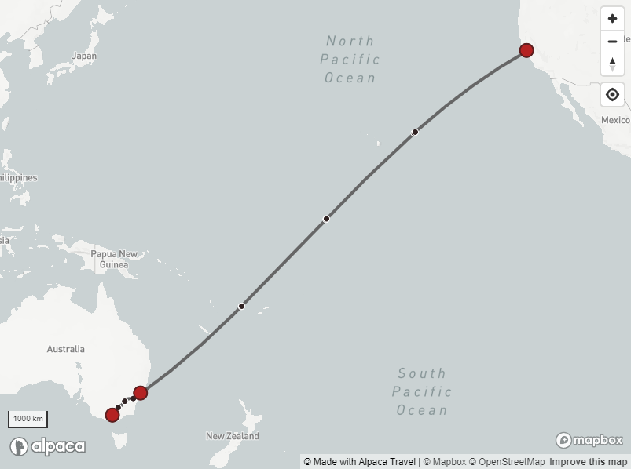
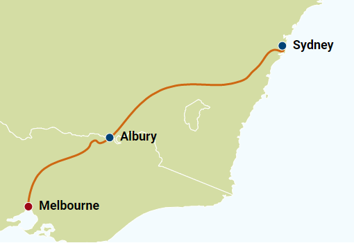

[//]: # "Weight: 2"

# Mapping



> Alpaca makes it easy for developers to present and work with content on maps.
> You can access GIS information through our API, of use our mapping service
> which creates consumeable mapping data to plug straight into mapping products

A core focus of the Alpaca `Itinerary` structures is to support content to be
presented on maps. As such, Alpaca provides a wide range geographic information
to be stored and accessed around your content.

Alpaca provides data that can be used with mapping clients, from desktop mapping
software such as QGis, or with popular website mapping clients such as Mapbox,
Google Maps, Leaflet or Pigeon Maps.

Alpaca provides access to the underlying mapping data via the GraphQL API, but
also provides various mapping services (which as documented
[here](https://github.com/AlpacaTravel/mapping-docs)).

### Prerequisites

- GraphQL development environment (or GraphQL Playground)

- Your API Key

- Itinerary IDs to query

# Querying Data via the API

Alpaca API uses a number of data types when used for querying mapping
information for your content. These data types will return the underlying
mapping information in various popular formats.

```graphql
# Query the itinerary. Obtain the lon/lat for each stop, as well as the
# polyline for directions to each stop.

query listItineraryLocationsWithItineraryDirections {
  itinerary(
    # Supply the itinerary ID
    id: "itinerary/ABC123"
  ) {
    # Select the associated itinerary locations using the children selector
    children(
      # Limit to querying the itinerary locations
      type: ItineraryLocation
      # Using the relay "cursor connection" specification for pagination
      # See: https://relay.dev/graphql/connections.htm
      first: 2
      after: null
    ) {
      edges {
        # Using the edge position, we can get a numbering of the result 1...X
        edgePositionNumber

        node {
          # ID/Types
          id
          __typename
          # Specific information drawn from the Itinerary Location
          ... on ItineraryLocation {
            # Query the itinerary location
            # Obtain the position
            position {
              lon
              lat
            }
            place {
              # ID/Types
              id
              __typename

              # Peel off what information we want from to show about the place
              name
              maki
            }
          }
        }
        # Query the directions
        directions(first: 1, direction: Inbound) {
          nodes {
            # ID/Types
            id
            __typename

            # Duration
            durationMin
            # Access the route modes (e.g. Car, etc)
            route {
              segments {
                # Access polyline or geojson for each segment
                mode
                polyline
              }
            }
          }
        }
      }
      # Total number of locations
      totalCount
      pageInfo {
        hasNextPage
        endCursor
      }
    }
  }
}
```

Sandbox: [Configure](/topics/graphql/Apollo%20Sandbox/) |
[Try Operation](https://studio.apollographql.com/sandbox/explorer?explorerURLState=N4IgJg9gxgrgtgUwHYBcQC4QGIAEBFGBAJwE8cUALBHASxRqWIENSA6HAeQCMUmHyqOADYQkAeiFMUOAGYQiOBEygUcAZxQQADgBocTNTgDuCIUP2HKCADpJcWiEJJCG1OQrA0iCKPVGWIRWVVDW1WW1sAR0JSYRoNAEl6RiIWEgAZaCkafwB1Ogok11TSABEvHz8kQ2BbHFpk5lIACjr6nFwAZRgtLScBajpitJwE0rb6mjB0HGsQIZS0sQBBACEAYQBGACYAZjm2gEocWqR2jpxO00qBizVoGikEMAbh2JEobP8cGDUGAHNbioaEIwN4zmprr55BMcMDQeDWmdzhd0jQ4HRyIFosQSADbgsmmQPl9qrD6igSFoEDMiotSJlPlVyRcAKp-JCAqw4bySMhzWBEe4KKCiRi+HJIObqalQGgyGhMyWyeQ4LRMf4MUksroIGk4CgoFBaNToMRiXlMEisMAIABuYn+qS0FEiQjEoqQ4qqalYhrgLIVQpQM22LKYMhQxBmSBgZlhx1OKMUYH+CBqLPquHZ+O5zzTaogfyqehMcKYZzT0iYOFjcC4xHxEBkt28ajj0k2rG7AA1Mym0wAFItDUQAOXgDaIEWRyaQEFtJ37WdGpTEABUqenl7QwDuAPr7ynUpBMRA7rqy+WK2hIdxwUk4MFMIxnGRECBwW50ok4Rna2dkxwbt2FEUZGhKDIsiqJdAKAi4CFxAkIJGElmTgoDcG4Xh+G5Bxi0lHd6nw0cziTeCUREKUMPgyQUCInAAF8GL6ZRqHIij2lwMYNy3NQGMmPcaKAw9j2QM8bGozjzlwQc9XMZsWyMCgpFve9HzLIwK2kd9PyxdQKAgIx9C4CAYGkPDJCgSTpPaU9z2E5MHwAaxoBjmMcpj+w8+DcEQ2JuU8bwJX8fsgsqSU1GaIMNBmTY9HCkKkFpJBTJgJAwETHd51tDNPJXHjN2pfj8t3BjRK3ezJIY3BShgVJ0NssB6tJABZBgapwZYoGstRLEED9zOoOAF3THBmgQVh-nYdYWD0BAUCgQ4GMGqNYNs+pIX+RBUDyjauK6nr00MBwnBcRgcFVNMIAAK3uN9VSUFR1AQbbkHo0rzhG20BPaU7nFcX6fOk4H4NBlFwfqSGLnXCBeHMOsp0uls0MillNHh9YzNQFl1TTBI70CDiURUtQxwQAAPFBBw1GygOQMB1nq4UWXB4GPMYkBGKAA)

If successful, your response will be similar to below

```json
{
  "data": {
    "itinerary": {
      "children": {
        "edges": [
          {
            "edgePositionNumber": 1,
            "node": {
              "id": "itinerary/ABC123/location/DEF456",
              "__typename": "ItineraryLocation",
              "position": {
                "lon": 144.9970825017,
                "lat": -37.803058481
              },
              "place": {
                "id": "place/atdw:product:56b23f9cb042386245d47ddb",
                "__typename": "Place",
                "name": "Tallaringa Views"
              }
            },
            "directions": {
              "nodes": []
            }
          },
          {
            "edgePositionNumber": 2,
            "node": {
              "id": "itinerary/4JhglLgOoo8zlx2yTQK3fq/location/71KzPu21YqJETG5RVnEQ0g",
              "__typename": "ItineraryLocation",
              "position": {
                "lon": 145.0043,
                "lat": -37.8021
              },
              "place": {
                "id": "place/atdw:product:5f115e78abc0d44d5a0cd076",
                "__typename": "Place",
                "name": "The Farm Cafe at the Collingwood Children's Farm"
              }
            },
            "directions": {
              "nodes": [
                {
                  "id": "itinerary/4JhglLgOoo8zlx2yTQK3fq/directions/6AcdRsWojtzzZTDbRcewrb",
                  "__typename": "ItineraryDirections",
                  "durationMin": 2.8942833333333335,
                  "route": {
                    "segments": [
                      {
                        "mode": "Car",
                        "polyline": "flveFiw~sZ}Ec@eEUiCSl@_Nj@{LdD^bC{L"
                      }
                    ]
                  }
                }
              ]
            }
          }
        ],
        "totalCount": 2,
        "pageInfo": {
          "hasNextPage": false,
          "endCursor": "eyJvZmZzZXQiOjF9"
        }
      }
    }
  }
}
```

## Coordinates

Coordinates are described by the `PositionType`. This provides the ability to
query longitude/latitude information from the platform.

## GeoJSON

GeoJSON is a popular GIS format that can represent a wide range of features,
such as points, linestrings and polygons. It is a relatively verbose format, but
can usually be dropped immediately as a data source into most mapping
technologies.

The `GeoJSON` data type offered by Alpaca also allows you to simplify the
complexity of features. This gives you a basic optimisation option when querying
data from the platform.

## Encoded Polylines

Polylines are an optimised representation for a linestring feature and available
for representing continous line data. We also offer simplication to reduce the
density of the data.

# Accessing mapping services

As mentioned above, you can use the GraphQL API or alternatively access our
mapping service which provides an optimised and idiomatic environment for
working with popular mapping technologies.

[View the documentation for our mapping services](https://github.com/AlpacaTravel/mapping-docs).

## Hosted datasets

Alpaca provides a specification for GeoJSON and Vector Tiles, as well as a
hosted vector tile service which enables developers easy way to access data.

These services can be accessed without leveraging the GraphQL API/

[View information about accessing data sets](https://github.com/AlpacaTravel/mapping-docs).

## SVG and other representations



In addition to detailed mapping representations and access via the API, Alpaca
Travel also provides unstyled SVG documents that can be styled using CSS or via
alternative design software.

The SVG's contain unique features to assist the common use cases of SVG, such as
producing generalised representations of routes (through simplifying routes or
introducing bezier splines) as well as choosing base map landmarks, such as
administrative boundaries (countries, regions, suburbs, postal etc) or tourism
regions.

See the
[mapping service documentation](https://github.com/AlpacaTravel/mapping-docs)
for more information about leveraging SVGs.

# Projection and Coordinate Reference System (CRS)

The coordinate reference system used by default in Alpaca is the the popular Web
[Mercator projection](https://en.wikipedia.org/wiki/Mercator_projection). This
is used by a majority of web mapping technology. Alpaca uses the
\[https://epsg.io/3857]\(EPSG:3857/WGS 84).
