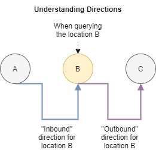
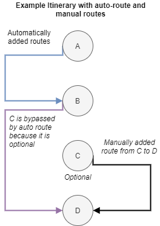

# Matching Directions

The API provides mechanisms for searching directions to locations. Directions
are managed by strategies such as via
[automatic routing](/topics/itinerary/Automatic%20Routing/README.md) or by
[adding directions](/topics/itinerary/Adding%20Directions/README.md) yourself
between your itinerary locations.

## Matching Directions to a List of Itinerary Locations

When listing locations of an itinerary, you can leverage the query edge data to
return any itinerary directions available between locations. This query method
makes it easier to display a list of locations, and between each of those
locations, indicate the directions that connect them.

We can differentiate between directions between locations by querying whether we
would like `Inbound` or `Outbound` directions.

<p align="center">
  
</p>

We can leverage the same `itinerary()` query with the `children()` operation and
add in the `directions()` operation. This operation allows you to query any
routes that can exist between the sequence of itinerary locations that you have
queried, in order to provide information on travel time.

```graphql
# Query the itinerary locations, with information about the directions between
# each of the locations

query QueryItineraryLocationsWithDirections {
  itinerary(
    # Supply the itinerary ID
    id: "itinerary/ABC123"
  ) {
    # Select the associated itinerary locations using the children selector
    children(
      # Limit to querying the itinerary locations
      type: ItineraryLocation
      # Using the relay "cursor connection" specification for pagination
      # See: https://relay.dev/graphql/connections.htm
      first: 10
    ) {
      edges {
        # Using the edge position, we can get a numbering of the result 1...X
        edgePositionNumber

        node {
          # ID/Types
          id
          __typename
          # Specific information drawn from the Itinerary Location
          ... on ItineraryLocation {
            # Query the itinerary location
            place {
              # Peel off what information we want from to show about the place
              name
              # Take what level from the address we want
              address {
                locality
              }
              # Categories, like restaurant, hotel etc
              layers {
                name
              }
            }
          }
        }
        # Additionally, query the routes between the locations as edge data,
        # which will obtain directions from the itinerary that arrive (Inbound)
        # to this location, from the last location in the edge sequence
        directions(first: 1, direction: Inbound) {
          nodes {
            # Duration
            durationMin
            # Access the route modes (e.g. Car, etc)
            route {
              segments {
                # Access polyline or geojson for each segment
                mode
              }
            }
            # Query any other ItineraryDirections data here..
          }
        }
        # Obtain the cursor to pass back as the "after" property
        cursor
      }
      # Total number of locations
      totalCount
    }
  }
}
```

Sandbox: [Configure](/topics/graphql/Apollo%20Sandbox/) |
[Try Operation](https://studio.apollographql.com/sandbox/explorer?explorerURLState=N4IgJg9gxgrgtgUwHYBcQC4QGIAEBFGBAJwE8cUALBHASxRqWIENScAbaJ+iJAZwBocAdzoVaSAGYQicLjR44mAIwgwU5KjjA0iCKNz44lCFEITIAOklwImUMRAkbqHKHJ68rVgI6FWBYhIASXpGIhYSABlOA14AdVEAER09WJxgKxxaUOZSAApMrJxcAGUYAAdytjJKajoGXLIgxMKsmjB0HAsQerCIgHoAQQAhAGEARgAmAGZuwoBKdNbinBKENlTnRV5eaBouBDBshvDWV3dDGF4GAHMt+xo2MF0kHF511Ollh6eXgteillcJEaHA6OQIDhfIFblteo12DF5HxllkUCRyghOiEThFom4DKiVgBVa5IO61HC6NhMMjdWBEXZEHBQHiMfTI7pvTFQGgSGgE5E4KTM8pMG4MC5E0rmToUFAocq8dD9frU2kAOjACAAbv0buFyhRvGx+qykOzYhr5XAifzGShOuMAAzLRYZAGAw43BC8JaewEkskUzTe6jlCDXAyCMwspivH3qJg4JDwYxEWGOLa6XgwNjqcYaosADSJWTDAAVI-UeAA5NPELwBwFICDa-2BwO4Zr9AAqGN9ZaK7SHWQA+mP0ZikExEKOViUeXyBeIRbIDFpwkJXhIiBA4FscX1WPipc3A0WNTgFEfGqeNx7O53cAFWJT4acyOdCefO1U7NQj5Ps+OAVuYbDXhIThCBQXCrtI65CrGQjxuou77hCbwUBAQiKCoahbP+UAIPOLaziRv5PrgvZMAA1tQMFwRsOrrMKe4HpSTBgM8vp+shqGkUUXE8TsHbAU+5xsHQJCCVkAC+skrKMBw3NINC+oIUn0VSvooEwMDhKggjYSgrEmFAik0iQxB+kB4mBjOc6UZ2CnOUUrn2R5T5eSBgzcTWM5sNUgjQm+mh7movpGCYZjIFs37In6TB+mGWhcEw-BDrgMECmIIhBdeSh6QwWgpByHhsRh745J+GhwSwGYsTgeRBEg+FIGA8xZZhlA0H6CU8II6EcZoNK8OoA2vCVlKpe80JIMRQ7aLo5V8Hk9rjU6gjLakyLYm1qgde686ttqtmCbgiQGWe9lZGA10GAAsgwF04IMUDEaJlIRaZOBwG2UV5AgGo3FeylEII5ldW5WQ-YBinvDciCoOdMNdm9H28TgEbVFJjDXsyPoQAAVrsO7SDgtj2G8CBI8gKCKVk-3aopPniWzwEvn4ZDxmQEC1Myt6fskK1pGA6U4FQuhFvOHPud1ADyRVMNNmgMkymFiqJSh2LR2xbN0TASKZRBcuUe6YkQ6JDurXznnL1H80wEGpnA6aQYigoeESKBO2woyHQzAZea5ckgHJQA)

We support the ability to support alternative directions between locations,
enabling the `Itinerary` to describe optional modes, routes or directions
between locations.

These itinerary directions can be pre-determined or automatically added using
the [automatic routing](/topics/itinerary/Automatic%20Routing/README.md) when
enabled on an itinerary, or you can manually create directions between
locations.

### Understanding `children()` query options `limitImmediate` and `skipOptional`

In more complex scenarios, it is possible to create itineraries that contain a
number of optional stops, auto-routing behaviour or manually added itinerary
directions (such as providing alternative modes of transportation etc).

<p align="center">
  
</p>

A reasonable default is used in order to identify which directions by default
are likely applicable when drawing a sequence of routes with an attempt to avoid
over-fetching data. It is possible to change this behaviour to select the
Itinerary Directions that you prefer, to widen the selection criteria.

Within the `directions()` query, you can control the selection criteria basis:

- `limitImmediate` will limit the which locations prior/next will be queried for
  directions. By default, we will only check for the immediately prior or next
  locations in the sequence. (Default = true)
- `skipOptional` will be used to determine whether to include optional stops in
  determining the immediate prior or next locations. By default, the query will
  bypass optional locations and continue to seek the immediate where optional is
  false. (Default = true)

#### `limitImediate`: true, `skipOptional`: true (Default)

This query is the default query configuration adopted for using the directions()
when querying children() of an itinerary.

| Location | Inbound Directions | Outbound Directions |
| -------- | ------------------ | ------------------- |
| A        |                    | A to B              |
| B        | A to B             | B to D              |
| C        |                    | C to D              |
| D        | B to D             |                     |

#### `limitImediate`: true, `skipOptional`: false

Alternatively, the routes could be queried including the optional stops as the
immediate.

| Location | Inbound Directions | Outbound Directions |
| -------- | ------------------ | ------------------- |
| A        |                    | A to B              |
| B        | A to B             |                     |
| C        |                    | C to D              |
| D        | C to D             |                     |

#### `limitImediate`: false, `skipOptional`: true

| Location | Inbound Directions | Outbound Directions |
| -------- | ------------------ | ------------------- |
| A        |                    | A to B              |
| B        | A to B             | B to D              |
| C        |                    | C to D              |
| D        | B to D             |                     |

#### `limitImediate`: false, `skipOptional`: false

| Location | Inbound Directions | Outbound Directions |
| -------- | ------------------ | ------------------- |
| A        |                    | A to B              |
| B        | A to B             | B to D              |
| C        |                    | C to D              |
| D        | C to D, B to D     |                     |

## Matching Directions to a single Itinerary Location

The Alpaca GraphQL API enables you to access a wide range of data both necessary
and optionally to create detailed itineraries. Leveraging GraphQL, you can join
the information into your listing query, or defer loading more information about
a single itinerary item to another call.

We encourage you to only request the information you need for your application
at any time, to avoid over-fetching data from the API.

Generally speaking, Alpaca has supported querying individual items by using the
`node()` query. You simply need to provide the ID to this function, and it will
enable you to query data about that item.

```graphql
# Query an itinerary location and load the associated inbound or outbound
# directions

query QueryItineraryLocationDirections {
  # Use the itineraryLocation operation
  node(
    # Supply the itinerary location ID
    id: "itinerary/ABC123/item/DEF456"
  ) {
    ... on ItineraryLocation {
      # Query the data you want for the itinerary location, such as
      # content or information about the place
      title
      place {
        address {
          locality
        }
        maki
        layers {
          name
        }
      }

      # Query any itinerary directions to or from this location
      # See information about matching directions
      directions(first: 2) {
        edges {
          # Inbound or outbound direction
          direction
          node {
            # Query the ItineraryDirection here
            durationMin
            distance
            route {
              segments {
                mode
              }
            }
          }
        }
      }
    }
  }
}
```

Sandbox: [Configure](/topics/graphql/Apollo%20Sandbox/) |
[Try Operation](https://studio.apollographql.com/sandbox/explorer?explorerURLState=N4IgJg9gxgrgtgUwHYBcQC4QGIAEBFGBAJwE8cBDJHASxWqWPNJwBtpy6IrKxWJzeKABYIKAZzHRqHBL3oAjCDCS8IRHEpSLlYADpJcYakQRROSMfv0BHQswLESASToMiTEgBl25gCLHTczEcYH0cHFwAVTFRYVFaekZSbygOai4NAAdGczCcJAgwBAAKPPDcAGUYTMyWMjiaVySyNlTzHCdfMpowdBxdEAS3DwB6AEEAIQBhAEYAJgBmEdoEOBHfAFEAMQAWAFYANgG8gEoQ7oA6K40qF0T3ZJ90qlCqcPfcB2YGsA5yHBIShwAHdKCgcAAzNQ4BpDZp8NrPAA0ODEMCgQnE3XKOCgXBQyHB0PoUKIcDSGXI2nBDVq5CgCGxMNoLEZb3eODpDPO7I5FDAYBMEh5fL5rXILFoJCZ4QAvjKcOSANbUBUscgkYjBV6ijlIciIBXy3lyqwmiL4OxkShkOEPMhGExmZ7BFAQDTqCFECBwGFCajBcW5c2VBDxJCk8ntKmaRUcDH0ADmOEdgRdTNTzq4YmKEOMYhQfTmZx1utkiYQ2oVOKcSG0Kg9GhgWiUDczwd173bz2r+UKolLnZxX3qIg6TXt-id7REJl74TAMHc5gAsvR5ymAyhKAyN97mwON+EYonEKgq+ah4r+0ecMar6bL+977qXxy33e8sbZSBZUA)

You can adapt the above query to support loading information specifically about
the `ItineraryDirection`.

## Additional Resources

- [Automatic Routing](/topics/itinerary/Automatic%20Routing/README.md)
- [Adding Directions](/topics/itinerary/Adding%20Directions/README.md)
