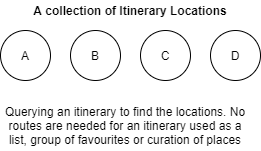
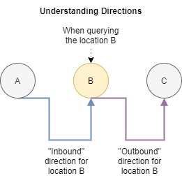
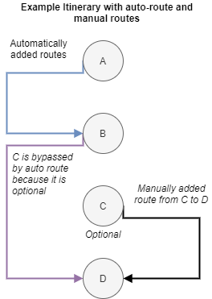

# Querying an Itinerary

Querying the itinerary depends largely on the way you want to present it to the
users. In order to provide as much flexibility as possible, Alpaca offers a
number of ways to query your itinerary.

### Prerequisits

- Your itinerary ID
- Your API Key

## Querying just the number of locations

You may wish to provide a simple interface UI that provides a list of the
number of itinerary locations within a list. Useful for when you are displaying
a number of locations that a user has in their itinerary.

```graphql
# Slim query just to access the number of locations

query QueryItineraryLocationsTotalCount {
  # Query using the itinerary() operation
  itinerary(
    # Supply the itinerary ID to query
    id: "itinerary/ABC123"
  ) {
    children(
      # Query the locations
      type: ItineraryLocation
      # We don't need any locations returned,
      first: 0
    ) {
      # Access the totalCount, indicating the total itinerary locations present
      totalCount
    }
  }
}
```

## Showing an Itinerary List

Alpaca's supports a wide range of itinerary structures, supporting basic
itineraries which are most common, such as; shortlists, favourites, and
sequentially routed itineraries, through to multi-day collections with
alternative route options and segments.

All these structures support a wide set of use cases, including simple
top-10 lists, walking trails, trips and itineraries. Alpaca leverages the
terminology of `Itinerary` regardless of the application.

The following section outlines some common queries to access information and
present in your application.

### Querying a Basic List of Locations (Favourites, Curated List, etc)

A common representation of an itinerary is used to display a list of favourites
that a user may have selected from a website, or a curated list of locations
that form a thematic shortlist.

<p align="center">
  
</p>

We can query the `Itinerary` and combine using the `itinerary()` and
`children()` operations to obtain information about the itinerary, and the
`ItineraryLocation`s as a list. The `ItineraryLocation` provides information
about a stop or place on an itinerary.

```graphql
# Query the itinerary locations for an itinerary, and access basic information
# about the place

query QueryItineraryLocationsAsSimpleList {
  itinerary(
    # Supply the itinerary ID
    id: "itinerary/ABC123"
  ) {
    # Select the associated itinerary locations using the children selector
    children(
      # Limit to querying the itinerary locations
      type: ItineraryLocation
      # Using the relay "cursor connection" specification for pagination
      # See: https://relay.dev/graphql/connections.htm
      first: 10
    ) {
      edges {
        node {
          # ID/Types
          id
          __typename
          # Specific information drawn from the Itinerary Location
          ... on ItineraryLocation {
            # Query the itinerary location
            place {
              # Peel off what information we want from to show about the place
              name
              # Take what level from the address we want
              address {
                locality
              }
              # Categories, like restaurant, hotel etc
              layers {
                name
              }
            }
          }
        }
        # Obtain the cursor to pass back as the "after" property
        cursor
      }
      # Total number of locations
      totalCount
    }
  }
}
```

The above query returns a list of ItineraryLocation type items, in the structure
of a GraphQL Connection. A GraphQL connection is a consistent scalable approach
to paginating that has been adopted in the API. You can learn more about using
a [GraphQL Connection here](/topics/graphql/Pagination%20using%20cursor%20connections/README.md).

## Querying a List of locations with directions between them

When listing locations of an itinerary, you can leverage the query edge data to
return any itinerary directions available between locations. This query method
makes it easier to display a list of locations, and between each of those
locations, indicate the directions that connect them.

We can differentiate between directions between locations by querying whether
we would like `Inbound` or `Outbound` directions.

<p align="center">
  
</p>

We can leverage the same `itinerary()` query with the `children()` operation
and add in the `directions()` operation. This operation allows you to query any
routes that can exist between the sequence of itinerary locations that you
have queried, in order to provide information on travel time.

```graphql
# Query the itinerary locations, with information about the directions between
# each of the locations

query QueryItineraryLocationsWithDirections {
  itinerary(
    # Supply the itinerary ID
    id: "itinerary/ABC123"
  ) {
    # Select the associated itinerary locations using the children selector
    children(
      # Limit to querying the itinerary locations
      type: ItineraryLocation
      # Using the relay "cursor connection" specification for pagination
      # See: https://relay.dev/graphql/connections.htm
      first: 10
    ) {
      edges {
        node {
          # ID/Types
          id
          __typename
          # Specific information drawn from the Itinerary Location
          ... on ItineraryLocation {
            # Query the itinerary location
            place {
              # Peel off what information we want from to show about the place
              name
              # Take what level from the address we want
              address {
                locality
              }
              # Categories, like restaurant, hotel etc
              layers {
                name
              }
            }
          }
        }
        # Additionally, query the routes between the locations as edge data,
        # which will obtain directions from the itinerary that arrive (Inbound)
        # to this location, from the last location in the edge sequence
        directions(first: 1, direction: Inbound) {
          nodes {
            # Duration
            durationMin
            # Access the route modes (e.g. Car, etc)
            route {
              segments {
                # Access polyline or geojson for each segment
                mode
              }
            }
            # Query any other ItineraryDirections data here..
          }
        }
        # Obtain the cursor to pass back as the "after" property
        cursor
      }
      # Total number of locations
      totalCount
    }
  }
}
```

We support the ability to support alternative directions between locations,
enabling the `Itinerary` to describe optional modes, routes or directions
between locations.

These itinerary directions can be pre-determined or automatically added using
the [automatic routing](/topics/itinerary/Automatic%20Routing/README.md) when
enabled on an itinerary, or you can manually create directions between
locations.

## Obtaining more information

The Alpaca GraphQL API enables you to access a wide range of data both necessary
and optionally to create detailed itineraries. Leveraging GraphQL, you can join
the information into your listing query, or defer loading more information about
a single itinerary item to another call.

We encourage you to only request the information you need for your application
at any time, to avoid over-fetching data from the API.

Generally speaking, Alpaca has supported querying individual items by using the
`node()` query. You simply need to provide the ID to this function, and it will
enable you to query data about that item.

```graphql
# Query an itinerary location and load the associated inbound or outbound
# directions

query QueryItineraryLocationDirections {
  # Use the itineraryLocation operation
  node(
    # Supply the itinerary location ID
    id: "itinerary/ABC123/item/DEF456"
  ) {
    ... on ItineraryLocation {
      # Query the data you want for the itinerary location, such as
      # content or information about the place
      title
      place {
        address {
          locality
        }
        maki
        layers {
          name
        }
      }
      # Query any itinerary directions to or from this location
      directions(first: 2) {
        edges {
          # Inbound or outbound direction
          direction
          node {
            # Query the ItineraryDirection here
            durationMin
            distance
            route {
              segments {
                mode
              }
            }
          }
        }
      }
    }
  }
}
```

You can adapt the above query to support loading information specifically
about the `ItineraryDirection`.

## Advanced Querying Topics

### Understanding `children()` query options "limitImmediate" and "skipOptional"

In more complex scenarios, it is possible to create itineraries that contain
a number of optional stops, auto-routing behaviour or manually added itinerary
directions (such as providing alternative modes of transportation etc).

<p align="center">
  
</p>

A reasonable default is used in order to identify which directions by default
are likely applicable when drawing a sequence of routes with an attempt to avoid
over-fetching data. It is possible to change this behaviour to select the
Itinerary Directions that you prefer, to widen the selection criteria.

Within the `directions()` query, you can control the selection criteria basis:

- `limitImmediate` will limit the which locations prior/next will be queried for
  directions. By default, we will only check for the immediately prior or next
  locations in the sequence. (Default = true)
- `skipOptional` will be used to determine whether to include optional stops
  in determining the immediate prior or next locations. By default, the query
  will bypass optional locations and continue to seek the immediate where
  optional is false. (Default = true)

#### limitImediate: true, skipOptional: true (Default)

This query is the default query configuration adopted for using the directions()
when querying children() of an itinerary.

| Location | Inbound Directions | Outbound Directions |
| -------- | ------------------ | ------------------- |
| A        |                    | A to B              |
| B        | A to B             | B to D              |
| C        |                    | C to D              |
| D        | B to D             |                     |

#### limitImediate: true, skipOptional: false

Alternatively, the routes could be queried including the optional stops as the
immediate.

| Location | Inbound Directions | Outbound Directions |
| -------- | ------------------ | ------------------- |
| A        |                    | A to B              |
| B        | A to B             |                     |
| C        |                    | C to D              |
| D        | C to D             |                     |

#### limitImediate: false, skipOptional: true

| Location | Inbound Directions | Outbound Directions |
| -------- | ------------------ | ------------------- |
| A        |                    | A to B              |
| B        | A to B             | B to D              |
| C        |                    | C to D              |
| D        | B to D             |                     |

#### limitImediate: false, skipOptional: false

| Location | Inbound Directions | Outbound Directions |
| -------- | ------------------ | ------------------- |
| A        |                    | A to B              |
| B        | A to B             | B to D              |
| C        |                    | C to D              |
| D        | C to D, B to D     |                     |

## Additional Resources

- [Creating an itinerary](/topics/itinerary/Creating%20an%20itinerary/README.md)
- [Adding Locations](/topics/itinerary/Adding%20Locations/README.md)
- [Automatic Routing](/topics/itinerary/Automatic%20Routing/README.md)
