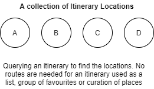

[//]: # "Weight: 2"
[//]: # "Title: Querying"

# Querying an Itinerary

Querying the itinerary depends largely on the way you want to present it to the
users. In order to provide as much flexibility as possible, Alpaca offers a
number of ways to query your itinerary.

The API provides various query capability in order to represent your itinerary
in various ways.

## Querying the total number of locations

You may wish to provide a simple interface UI that provides a list of the number
of itinerary locations within a list. Useful for when you are displaying a
number of locations that a user has in their itinerary.

```graphql
# Slim query just to access the number of locations

query QueryItineraryLocationsTotalCount {
  # Query using the itinerary() operation
  itinerary(
    # Supply the itinerary ID to query
    id: "itinerary/ABC123"
  ) {
    children(
      # Query the locations
      type: ItineraryLocation
      # We don't need any locations returned,
      first: 0
    ) {
      # Access the totalCount, indicating the total itinerary locations present
      totalCount
    }
  }
}
```

Sandbox: [Configure](/topics/graphql/Apollo%20Sandbox/) |
[Try Operation](https://studio.apollographql.com/sandbox/explorer?explorerURLState=N4IgJg9gxgrgtgUwHYBcQC4QGIAEBlAGwEs4cBHGBAJwE8cArGAZxRxQhwEMooEmm2ACwQ4k8AEbUcEAGY4C0TiiIQkTADpJNFanQCKlWgEllSap1oAZRctVMAKhBScCAYQgxUOYJpw5cBro4zERIAOZCIkSm5rQAFACU0gAO5rZaSH7RobE0cb5+-vgwyckEdCjCONlmVBZ0RgAibBw6tAVZYOg46iA1uQD0AIIAQq4AjABMAMy9BUk+mYVQgkQEYFTI+UuFRYG0kfI2KmodhSg0qd0mOXVWx6pnfrgA6iKQSADkrGYIYFxIOgKKBKE4CTYoGBUMxgAA0TxwMiIVBY3QADGcFgjcEMeHwBJUROxnG4PKhYdUkGAiCDTBFCS0SdUYncgQ81DhkpsmMgUAjiS53J4+TscABfAoSpBikBioA)

If successful, the response will look like this:

```json
{
  "data": {
    "itinerary": {
      "children": {
        "totalCount": 10
      }
    }
  }
}
```

## Showing the Itinerary Locations as a list

Alpaca's supports a wide range of itinerary structures, supporting basic
itineraries which are most common, such as; shortlists, favourites, and
sequentially routed itineraries, through to multi-day collections with
alternative route options and segments.

All these structures support a wide set of use cases, including simple top-10
lists, walking trails, trips and itineraries. Alpaca leverages the terminology
of `Itinerary` regardless of the application.

The following section outlines some common queries to access information and
present in your application.

### Querying a Basic List of Locations (Favourites, Curated List, etc)

A common representation of an itinerary is used to display a list of favourites
that a user may have selected from a website, or a curated list of locations
that form a thematic shortlist.

<p align="center">
  
</p>

We can query the `Itinerary` and combine using the `itinerary()` and
`children()` operations to obtain information about the itinerary, and the
`ItineraryLocation`s as a list. The `ItineraryLocation` provides information
about a stop or place on an itinerary.

```graphql
# Query the itinerary locations for an itinerary, and access basic information
# about the place

query QueryItineraryLocationsAsSimpleList {
  itinerary(
    # Supply the itinerary ID
    id: "itinerary/ABC123"
  ) {
    # Select the associated itinerary locations using the children selector
    children(
      # Limit to querying the itinerary locations
      type: ItineraryLocation
      # Using the relay "cursor connection" specification for pagination
      # See: https://relay.dev/graphql/connections.htm
      first: 10
    ) {
      edges {
        node {
          # ID/Types
          id
          __typename
          # Specific information drawn from the Itinerary Location
          ... on ItineraryLocation {
            # Query the itinerary location
            place {
              # Obtain the place provider ID
              id
              # Peel off what information we want from to show about the place
              name
              # Take what level from the address we want
              address {
                locality
              }
              # Categories, like restaurant, hotel etc
              layers {
                name
              }
            }
          }
        }

        # Using the edge position, we can get a numbering of the result 1...X
        # See Poistion Number information for using these
        position: edgePositionNumber(
          type: ItineraryLocation
          skipOptional: true
          skipOmitList: true
        )

        # Obtain the cursor to pass back as the "after" property
        cursor
      }
      # Total number of locations
      totalCount
    }
  }
}
```

Sandbox: [Configure](/topics/graphql/Apollo%20Sandbox/) |
[Try Operation](https://studio.apollographql.com/sandbox/explorer?explorerURLState=N4IgJg9gxgrgtgUwHYBcQC4QGIAEBFGBAJwE8cUALBHASxRqWIENScAbaJ+iJAZxwBmEIjiZJa9RkRYkANKKRhRUKAl78ARk140otJEKJwuNHgB0kuJhogwU5KjgAObJqosWAjoVYFiJAElJZlIAGU5uPgBBXgBlGjgXBFCaXntgCxwJBhCSAApMrJxcWJgnFzJKajoc6VYAgBFCrJowdBwzEBqpGQB6KIAhAGEARgAmAGZOwoBKHAzxIpKENgQoeyrRdWgaLgQlbtz2CNM+HBgdJABzB2ooCho2MCJkHF4VtZRhZpx7x+fkAVFkVijgUnA6OQIDhvP4GDdNoc6mQOFATDxeD8sigSE4EO0grUZOE0ZEsaCAKqXBGOF6uMidWBEXjCX48RjrU6dN54qA0AS6dHiQzOJhXBhC8nLfE4CgoFBOXjoXq9OlMEgAOjACAAbr0rtInBRPGxelB2Z9TrwNXK4OSBcyUO0RgAGH5zBYgrL7K5qebkrJICDa-3Ar1ZXCNXoAFVxagDRVaCayAH0Uzi8UgmIhk6DYrz+bp9IZjJEcM8mAB3YVECBwW44Qk9VgkyVh8Mazs4HiN4LI1tlz3hr24PysRF9mTHUlc9vDlxuahD4cjnAAeQ0KCYDAbC9UzlrOtaxEbTTnK6T5+HuAACggVt2BAIcJWKFxi8JS6cX9RK2J7AItb1l8bwUBAlaiDYdi7q47hXuGWY5vBq7RkwADWv5vvYqw6g+gF1g2TBgAC6g-i+-65iCREkfwy4rl6qJMGwdAkJRRQAL5sRGOBDHsVzCDQajyMxGE4C8aRMDA0ioPIYEoA+CAoFAXHsOqxC0SpgbZggKmcchWR6fROCGcOekJrgVLwg2PrUE4EA6JE8iVncYg4L69hMDgSDwBoxBWRAz6bOJMBsPYIydhqAAa5k4LE944DeECpGWAByPkngwJZCoIrIXFZVTvAmdkOac7Q2YlJU8GlcC+UQQJGRmMpNrkA6zkZvBoTQThrk4kRMe0KBEIQuYdV1a4QigKRpANQ06VeMweFeuAbluO6bEyLIiCBTjaJobhoVsDadEwAjyUQ3JOLWeJEDiCYbd8c4mSCuDRhAW5sF56UiAF05Cpic5fO9Qy2KgPwmXp7EgOxQA)

The above query returns a list of ItineraryLocation type items, in the structure
of a GraphQL Connection. A GraphQL connection is a consistent scalable approach
to paginating that has been adopted in the API. You can learn more about using a
[GraphQL Connection here](/topics/graphql/Pagination%20using%20cursor%20connections/README.md).

```json
{
  "data": {
    "itinerary": {
      "children": {
        "edges": [
          {
            "node": {
              "id": "itinerary/ABC123/location/DEF456",
              "__typename": "ItineraryLocation",
              "place": {
                "id": "place/atdw:product:56b23f9cb042386245d47ddb",
                "name": "Tallaringa Views",
                "address": {
                  "locality": "Alstonville"
                },
                "layers": [
                  {
                    "name": "Accommodation"
                  },
                  {
                    "name": "Apartments"
                  },
                  {
                    "name": "Cottages"
                  }
                ]
              }
            },
            "position": 1,
            "cursor": "eyJvZmZzZXQiOjB9"
          },
          {
            "node": {
              "id": "itinerary/ABC123/location/GHI789",
              "__typename": "ItineraryLocation",
              "place": {
                "id": "place/atdw:product:5f115e78abc0d44d5a0cd076",
                "name": "The Farm Cafe at the Collingwood Children's Farm",
                "address": {
                  "locality": "Abbotsford"
                },
                "layers": [
                  {
                    "name": "Food and Drink"
                  },
                  {
                    "name": "Produce"
                  },
                  {
                    "name": "Restaurant and Cafe"
                  }
                ]
              }
            },
            "position": 2,
            "cursor": "eyJvZmZzZXQiOjF9"
          }
        ],
        "totalCount": 2
      }
    }
  }
}
```

## List Presentation

When display a list, you may need to consider how you present the list. This
could include what text you want to display along with the list, and whether the
list should be presented ordered or unordered.

On an itinerary, these fields can assist determine the way you want to display
the list.

| Attribute ID                  | Description                                                                              |
| ----------------------------- | ---------------------------------------------------------------------------------------- |
| `itinerary/list-name`         | A name to associate with the itinerary list (string, localised)                          |
| `itinerary/list-presentation` | Whether the list is to be considered ordered or unordered (string: ordered or unordered) |

Similarly, if showing a list of places against an Itinerary Location you can use
the following attributes:

| Attribute ID                           | Description                                                                              |
| -------------------------------------- | ---------------------------------------------------------------------------------------- |
| `itinerary/location/list-name`         | A name to associate with the itinerary list (string, localised)                          |
| `itinerary/location/list-presentation` | Whether the list is to be considered ordered or unordered (string: ordered or unordered) |

## Additional Query Topics

## Matching Directions

When you query the itinerary, you can also match corresponding directions
between the Itinerary Locations, such as showing driving times or routes between
locations in your itinerary.

See
[Matching Directions](/topics/itinerary/Querying%20an%20Itinerary/Matching%20Directions/README.md)

## Position Numbering

Leverage a position numbering strategy when showing your itinerary in a list.

See
[Position Numbering](/topics/itinerary/Querying%20an%20Itinerary/Position%20Numbering/README.md)

## Additional Resources

- [Creating an itinerary](/topics/itinerary/Creating%20an%20itinerary/README.md)
- [Adding Locations](/topics/itinerary/Location/Adding%20Locations/README.md)
