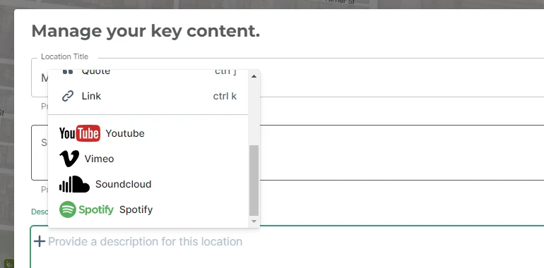

[//]: # "Title: 3rd Party Media"
[//]: # "Weight: 2"

# 3rd Party Media

Users of the Itinerary Editor are provided with the option to include 3rd-party
media within their Markdown content.

<aside class="info">
  Markdown is used in the long-form description field for Itineraries and 
  Locations. It is recommended that 3rd party media appears as a link.
</aside>

# YouTube, Vimeo, SoundCloud and Spotify



Currently, the Alpaca platform renders the YouTube, Vimeo, SoundCloud and
Spotify when displaying content through the embeds.

Users in the Itinerary Editor will paste the share link into the markdown and
this will be recognised and substituted with the correct iframe embed
presentation.

## YouTube

YouTube can be used within content to display videos.

```markdown
Here is an example of youtube appearing in markdown.

https://www.youtube.com/watch?v=dQw4w9WgXcQ
```

<aside>
  The below gist gives you an idea of how you may extract out and present an 
  Iframe from a youtube link within your application.
</aside>

```javascript
// Matching the ID for Youtube Links
export const youtubeRegEx =
  /^(?:https?:\/\/)?(?:i\.|www\.|img\.)?(?:youtu\.be\/|youtube\.com\/|ytimg\.com\/)(?:embed\/|v\/|vi\/|vi_webp\/|watch\?v=|watch\?.+&v=)((\w|-){11})(?:\S+)?$/;

// ... match against the markdown depending on your parser

// Example Youtube iframe attributes
const youtubeIframeAttributes = {
  src: `https://www.youtube.com/embed/${ID}?modestbranding=1`,
  allow:
    "accelerometer; autoplay; clipboard-write; encrypted-media; gyroscope; picture-in-picture",
  allowfullscreen: true,
  frameborder: 0,
};
```

## Vimeo

Vimeo provides an alternative to using YouTube to display video content.

```markdown
Here is an example of vimeo appearing in markdown.

https://vimeo.com/783453158
```

<aside>
  The below gist gives you an idea of how you may extract out and present an 
  Iframe from a vimeo link within your application.
</aside>

```javascript
// Matching the ID for Vimeo Links
export const vimeoRegEx =
  /https?:\/\/(?:vimeo\.com\/|player\.vimeo\.com\/)(?:video\/|(?:channels\/staffpicks\/|channels\/)|)((\w|-){7,9})/;

// ... match against the markdown depending on your parser

// Build the attributes to be used in an iframe for displaying vimeo
const vimeoIframeAttributes = {
  src: `https://player.vimeo.com/video/${ID}`,
  frameborder: "0",
  allow: "autoplay; fullscreen; picture-in-picture",
  allowfullscreen: true,
};
```

## SoundCloud

SoundCloud is typically used to host audio content attached to itineraries, such
as for the use in audio tours.

```markdown
Here is an example of including SoundCloud content within markdown

https://soundcloud.com/rick-astley-official/never-gonna-give-you-up-4?utm_source=clipboard&utm_medium=text&utm_campaign=social_sharing
```

<aside>
  The below gist gives you an idea of how you may extract out and present an 
  Iframe from a SoundCloud link within your application.
</aside>

```javascript
// SoundCloud
export const soundcloudRegEx =
  /https?:\/\/(?:w\.|www\.|)(?:soundcloud\.com\/)(?:(?:player\/\?url=https\%3A\/\/api.soundcloud.com\/tracks\/)|)(((\w|-)[^A-z]{8})|([A-Za-z0-9]+(?:[-_][A-Za-z0-9]+)*(?!\/sets(?:\/|$))(?:\/[A-Za-z0-9]+(?:[-_][A-Za-z0-9]+)*){1,2}))/;
export const soundcloudRegExAlternative =
  /api\.soundcloud\.com\/tracks\/([a-z\d]+)/i;

// ... match against the markdown depending on your parser

// Build the attributes to be used in an iframe for displaying soundcloud
const soundcloudIframeAttributes = {
  src: `https://w.soundcloud.com/player/?url=https://soundcloud.com/${ID}&color=%23cad5dd&auto_play=false&hide_related=true&show_comments=false&show_user=true&show_reposts=false&show_teaser=true`,
  scrolling: "no",
  frameborder: "no",
  allow: "autoplay",
  width: "100%",
  height: 166,
};
```

## Spotify

Spotify offers a mechanism to add a playlist to your itinerary.

```markdown
Here is an example of a spotify playlist appearing within markdown

https://open.spotify.com/playlist/37i9dQZF1DX9wC1KY45plY
```

<aside>
  The below gist gives you an idea of how you may extract out and present an 
  Iframe from a Spotify playlist link within your application.
</aside>

```javascript
// Spotify
export const spotifyURLRegex =
  /https?:\/\/(?:embed\.|open\.)(?:spotify\.com\/)(?:(album|track|playlist)\/|\?uri=spotify:track:)((\w|-){22})/;
export const spotifySymbolRegex =
  /spotify:(?:(album|track|playlist):|\?uri=spotify:track:)((\w|-){22})/;

// ... match against the markdown depending on your parser

// Build the attributes to be used in an iframe for displaying spotify playlist
const spotifyIframeAttributes = {
  src: `https://open.spotify.com/embed/${type}/${id}`,
  allow:
    "autoplay; clipboard-write; encrypted-media; fullscreen; picture-in-picture",
  allowtransparency: "true",
  allowfullscreen: "true",
  style: { borderRadius: "12px" },
  width: "100%",
  height: "152",
  // loading: 'lazy',
  frameborder: 0,
};
```
